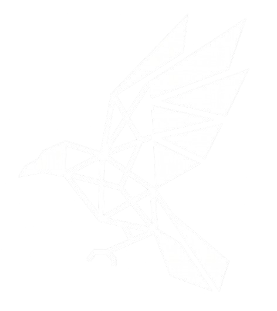

  

<h1 align="center">Krow</h1>

<h3 align="center">Dream. Think. Build.</h3>

  
  
  
  

---

## Who We Are

Krow is a software company building tools, systems, and products with precision and purpose.

We operate at the intersection of engineering, intelligence, and craft.

Our work spans intelligent systems, developer infrastructure, automation, and open-source tooling. Everything we build is guided by a commitment to quality, clarity, and long-term impact.

## Philosophy

Technology should be built with intention.

> Great software is not accidental. It is the result of clear thinking, rigorous engineering, and honest design.

We follow three principles:

### Dream

Ideas are the origin of all progress.

Before writing code, we spend time understanding the problem space, imagining what is possible, and defining what success looks like.

### Think

Every decision is a trade-off.

We favour first-principles reasoning over trends. We ask why before asking how. We optimise for simplicity, clarity, and correctness over cleverness.

### Build

Ideas only matter when they become real.

We ship with discipline. We value reliable systems, clean interfaces, and incremental progress. We build for the long term, not the quick win.

## Focus Areas

| Area | Description |
| --- | --- |
| **Intelligent Systems** | Practical AI tooling, automation, and inference infrastructure. |
| **Developer Tools** | CLIs, libraries, and platform components that improve the developer experience. |
| **Software Systems** | Distributed systems, APIs, and backend infrastructure. |
| **Open Source** | Shared libraries, internal tooling, and community contributions. |
| **Security** | Secure-by-default design and infrastructure hardening. |
| **Automation** | Reducing toil, improving reliability, and enabling scale. |

## Products

### Coming Soon

Krow is actively developing its first generation of products.

We do not announce products before they are ready. When the first releases are prepared, we will publish detailed documentation, open beta programs, and public roadmaps here and on our website.

## Open Source

We believe in building in the open.

Many of the systems we develop are open-sourced so the community can use, audit, and improve them. We welcome contributions, issues, and honest feedback.

## Engineering Culture

### How We Build

- **Ownership end-to-end.** Teams ship features from design to deployment.
- **Small, focused PRs.** Reviews are thorough and thoughtful.
- **Tests are required.** Quality is not optional.
- **Documentation is part of the product.** Code is read far more often than it is written.
- **Performance matters.** Fast systems respect the user's time.

### Code Quality

- Linting and static analysis are enforced.
- Type safety is preferred where applicable.
- CI/CD runs on every pull request.
- We review for design, correctness, and maintainability.

## Vision

We aim to build software that developers trust and users depend on.

Long term, Krow will ship products that influence how teams build, deploy, and operate systems. Our focus is always on creating durable value.

## Connect

| Channel | Link |
| --- | --- |
| **Website** | [krow-mocha.vercel.app](https://krow-mocha.vercel.app/) |
| **GitHub** | [github.com/krowft](https://github.com/krowft) |
| **LinkedIn** | [linkedin.com/company/krowft](https://www.linkedin.com/company/krowft) |
| **Discord** | [Join the community](https://discord.gg/aa3HPzyVv) |
| **Issues** | [Report a bug or request a feature](https://github.com/krowft/Krow/issues) |

## Contact

For business inquiries, partnerships, or security-related contact, please visit our [website](https://krow-mocha.vercel.app/) or open an issue on this repository.

---

  
    
  <strong>Krow</strong> — Dream. Think. Build.

